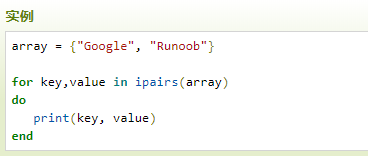

# LearnLua
Lua学习笔记

- Lua 里表的默认初始索引一般以 1
- Lua 中的表（table）其实是一个"关联数组"

## lua 中的变量
- Lua 变量有三种类型：全局变量、局部变量、表中的域。
- Lua 中的变量全是全局变量，那怕是语句块或是函数里，除非用 local 显式声明为局部变量。
- 局部变量的作用域为从声明位置开始到所在语句块结束。
- 变量的默认值均为 nil。
- 访问局部变量的速度比全局变量更快。


## lua 中的函数
- Lua函数可以返回多个结果值
- Lua 函数支持可变参数

## lua 中的模块与包
- Lua 的模块是由变量、函数等已知元素组成的 table

### lua 中模块的加载策略
- lua中的包分为两种，一种是c包，一种是lua包， lua包直接加载就可以使用，c包则要加载后连接来使用。
- Lua 中模块的搜索路径是由个全局变量来定义的，一个是**package.path**,另一个是**package.cpath**(c程序库路径，搜so或者dll文件)，搜索的时候先搜索前者然后是后者。
- 当lua启动后会读取系统中**LUA_PATH **和**LUA_CPATH **两个环境变量的值来初始化这个全局变量。如果没有找到这个环境变量则使用一个编译时定义的默认路径来进行初始化。
- 找到模块后会调用package.loadlib来进行加载。

## lua 中的表
- Lua支持多维数组
- Lua table 使用关联型数组，你可以用任意类型的值来作数组的索引，但这个值不能是 nil。

## lua 中的元表
- 通过使用 元表可以自定义和改变table的行为，让每个行为关联了对应的元方法。有点像C++中的运算符重载。(使用元表来实现多态？)

## lua中的协程
- 拥有独立的堆栈，独立的局部变量，独立的指令指针，同时又与其它协同程序共享全局变量和其它大部分东西。
- 在任一指定时刻只有一个协同程序在运行，并且这个正在运行的协同程序只有在明确的被要求挂起的时候才会被挂起。

## lua 中的迭代器
lua 中的迭代器分为两类
- 无状态的迭代器
- 有状态的迭代器
	- 无状态的迭代器是指不保留任何状态的迭代器，因此在循环中我们可以利用无状态迭代器避免创建闭包花费额外的代价。
	- 每一次迭代，迭代函数都是用两个变量（状态常量和控制变量）的值作为参数被调用，一个无状态的迭代器只利用这两个值可以获取下一个元素。	


lua 中泛型for的执行流程

1. 开始时首先执行**in**后面的表达式，表达式执行后返回三个值，**迭代函数**，**状态变量** ,** 控制变量**不足三个会自动用 nil 补足，多出部分会被忽略.
2. 将状态常量和控制变量作为参数调用迭代函数
3. 将迭代函数返回的值赋给变量列表
4. 如果返回的第一个值为nil循环结束，否则执行循环体。
5. 回到第二步再次调用迭代函数


## Lua 中的面向对象
**lua 中定义一个类**
```lua

-- 不涉及成员的隐藏
function  Create_Shape( _name,_id )
	-- body
	local obj = {Name = _name,ID = _id}

	function obj:PrintInfo(  )
		print(self.Name,self.ID)
		-- body
	end

	return obj
end

-- 使用闭包来隐藏成员
function Create_Shape2(_name,_id)

	local data = {name = _name,id = _id}

	local obj = {}

	function obj:SetName(__name)
		data.name = __name;
	end


	function obj:SetID(__id)
		data.id = __id;
	end


	function obj:GetName()
		return data.name;
	end


	function obj:GetID()
		return data.id;
	end

	function obj:PrintInfo(  )
		print(data.name,data.id)
		-- body
	end

	return obj;

end

shape = Create_Shape('Shape','001')
shape:PrintInfo()

--测试闭包实现
shape2 = Create_Shape2('Shape2','002')
shape2:SetName('super Shape2')
shape2:SetID('004')
shape2:PrintInfo()
```
**lua 中的继承**
```lua
function  Create_Shape( _name,_id )
	-- body
	local obj = {Name = _name,ID = _id}

	function obj:PrintInfo(  )
		print(self.Name,self.ID)
		-- body
	end

	return obj
end

-- 使用元表来实现继承
function Create_Retangle(_name,_id ,_side)
	-- body
	local  obj = Create_Shape(_name,_id)

	local  retangle = {Side = _side}
	
	setmetatable(retangle,obj)
	obj.__index = obj;

	return retangle;
end

-- 不使用元表来实现继承
function Create_Retangle2(_name,_id ,_side)
	local  obj = Create_Shape(_name,_id)
	obj.Side = _side;
	return obj
end


shape = Create_Shape('Shape','001')
retangle = Create_Retangle('Retangle','002',2)
retangle2 = Create_Retangle2('Retangle','003',2)

shape:PrintInfo()
retangle:PrintInfo()
retangle2:PrintInfo()

```

## lua 中的闭包
lua中的闭包是指函数和与其相关的引用环境组合而成的实体。闭包=函数+引用环境。子函数可以使用父函数中的局部变量，这种行为叫做闭包。lua中的函数和C/C++ 中的函数的不同之处在于lua中的函数他是一个类型，而C/C++中的函数其实就是一个指向内存中某些指令的指针。

在Lua函数中再定义函数，称为内嵌函数，内嵌函数可以访问外部函数已经创建的所有局部变量，而这些变量就被称为该内嵌函数的upvalue（upvalue实际指的是变量而不是值），这些变量可以在内部函数之间共享。于是成全了Lua中闭包。

```lua
function fn()
    local i = 0
    return function()     -- 注意这里是返回函数的地址，不是执行
       i = i + 1
        return i
    end
end

c1 = fn()                      -- 接收函数返回的地址
print(c1())                    --> 1          --c1()才表示执行
--local i = 0的意思是重新创建一个新的变量，这里没有创建新的？
print(c1())                    --> 2

--再次调用fn，将创建一个新的局部变量i
c2 = fn()
print(c2())  -->1
print(c1())  -->3
print(c2())  -->2


```

